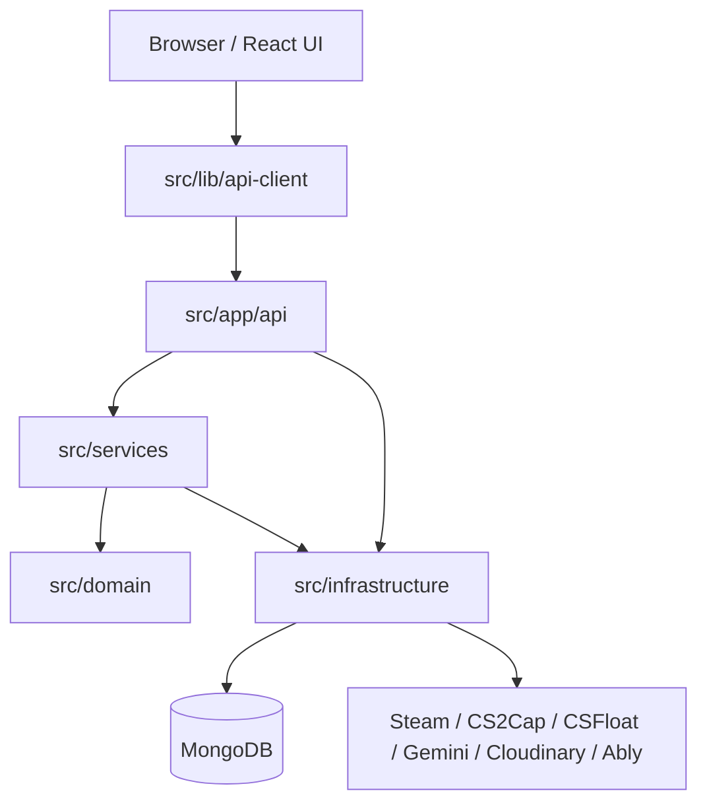
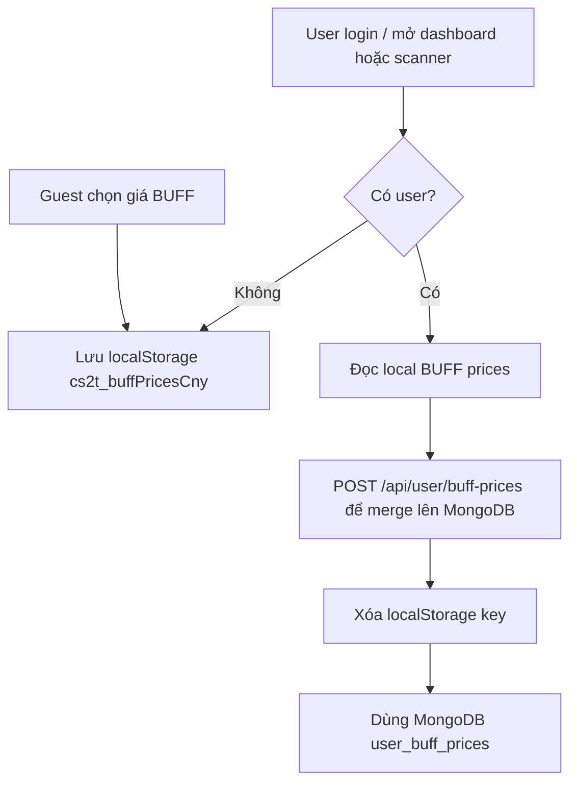
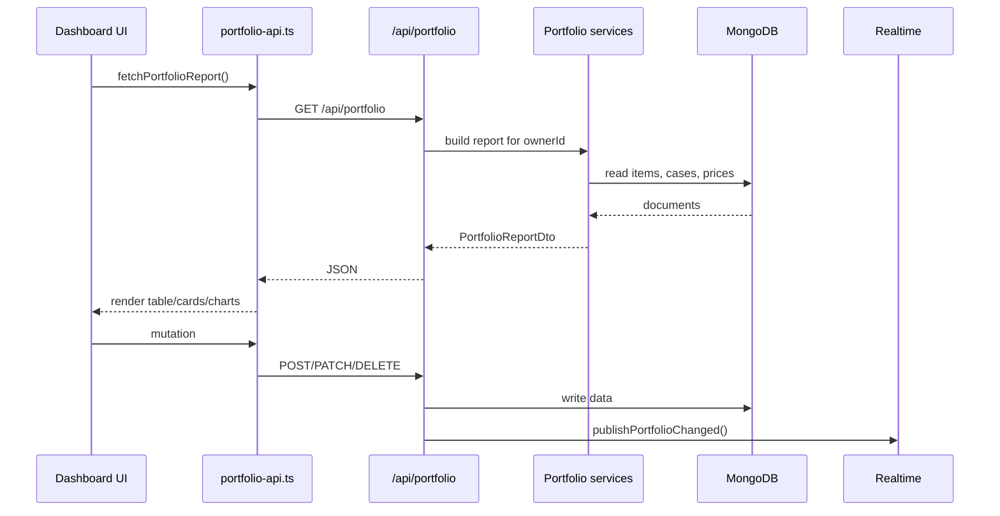
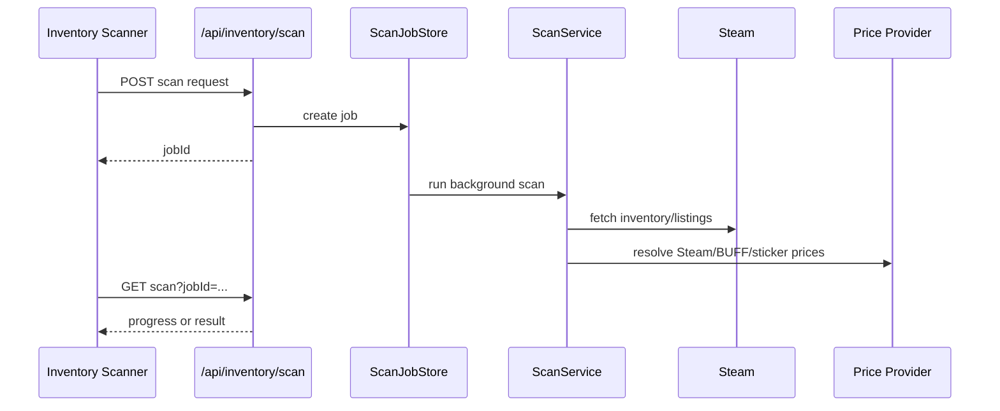

# Kiến Trúc Dự Án

Tài liệu này giải thích cách CS2 Tracking được tổ chức, dữ liệu đi qua các layer nào, dữ liệu nào nằm trong MongoDB, dữ liệu nào còn ở `localStorage`, và realtime portfolio đang hoạt động ra sao.

## Tổng Quan

App là một dự án Next.js App Router. Frontend React và API routes nằm chung repo.

Kiến trúc hiện tại là hybrid Clean Architecture:

- `components`: UI và hook theo feature.
- `lib/api-client`: wrapper `fetch` chạy trong browser.
- `app/api`: HTTP boundary của Next.js.
- `services`: orchestration và business logic server-side.
- `domain`: entity, domain type, repository interface.
- `infrastructure`: MongoDB, repository implementation, Steam/price/external providers.



Một số API route lớn vẫn thao tác MongoDB trực tiếp. Khi thêm code mới, ưu tiên giữ route mỏng và đưa logic dài sang `src/services`.

## Bản Đồ Thư Mục

| Thư mục              | Vai trò                               | Ví dụ                                             |
| -------------------- | ------------------------------------- | ------------------------------------------------- |
| `src/app`            | Pages, layouts, API routes            | `app/api/portfolio/route.ts`                      |
| `src/components`     | UI theo feature                       | `dashboard`, `portfolio`, `inventory-scanner`     |
| `src/lib/api-client` | Hàm `fetch` dùng trong browser        | `portfolio-api.ts`, `user-buff-prices-api.ts`     |
| `src/services`       | Business logic server-side            | `auth-service.ts`, `realtime/portfolio-events.ts` |
| `src/domain`         | Type và contract cốt lõi              | `portfolio-item.ts`, `storage-unit.ts`            |
| `src/infrastructure` | MongoDB, repository, external drivers | `db`, `price`, `steam.ts`                         |
| `src/hooks`          | Hook dùng chung                       | `use-portfolio-realtime.ts`                       |
| `src/stores`         | Store nhỏ cho progress/toast          | `import-store.ts`, `sync-store.ts`                |
| `src/types`          | DTO/type dùng chung                   | `report.ts`, `portfolio-import.ts`                |
| `src/utils`          | Helper thuần                          | `buff-prices.ts`, `validation.ts`                 |
| `src/i18n`           | Bản dịch                              | `vi.json`, `en.json`                              |
| `src/data`           | Dữ liệu tĩnh                          | tier, pattern, sticker map                        |

## Quy Tắc Dependency

Hướng phụ thuộc nên giữ:

```text
components -> lib/api-client -> app/api
app/api -> services -> domain
services -> infrastructure khi cần DB/driver cụ thể
infrastructure -> domain
utils/types -> được dùng bởi nhiều layer
```

Không nên làm:

- `services` import từ `components`.
- `lib/api-client` import từ `components` hoặc `stores`.
- `domain` import MongoDB, Next.js, React hoặc browser API.
- API route mới chứa quá nhiều orchestration dài hàng trăm dòng.
- Type dùng chung nằm trong UI rồi bị server import ngược.

## Owner, Auth Và Guest

Auth hiện tại dùng Google OAuth và session cookie riêng:

- Session cookie: `cs2t_session`.
- OAuth state cookie: `cs2t_oauth_state`.
- Guest cookie: `cs2t_guest_id`.

Owner model:

| Trạng thái      | `ownerId`               |
| --------------- | ----------------------- |
| Đã login Google | `google:<googleUserId>` |
| Chưa login      | `guest:<uuid>`          |

Hàm chính:

- `getCurrentUser()` đọc và verify session.
- `getGuestId()` tạo/đọc guest owner.
- `getPortfolioOwnerId()` trả về Google owner nếu login, ngược lại guest owner.
- `getOwnerFilter(ownerId)` tạo filter MongoDB an toàn theo owner.

Khi Google callback thành công, `mergeGuestDataToUser()` gộp dữ liệu guest sang user:

- `portfolio_items`
- `storage_units`
- `portfolio_accounts`

Nếu có Steam account bị trùng `steamId64`, bản guest trùng sẽ bị xóa để tránh vi phạm unique index.

## Dữ Liệu Trong MongoDB Và localStorage

### MongoDB là nguồn chính

Các dữ liệu gắn với tài khoản hoặc portfolio phải nằm trong MongoDB:

- Portfolio item
- Steam account đã link
- Storage Unit
- User Google
- CS2Cap key đã mã hóa
- BUFF price thủ công của user đã login
- Event realtime ngắn hạn

### localStorage chỉ dùng cho dữ liệu nhẹ phía client

`localStorage` hiện còn dùng cho:

- BUFF price thủ công trước khi login: `cs2t_buffPricesCny`
- Tỷ giá BUFF CNY/VND trong UI
- Column visibility
- Draft form
- Recent imports
- Một số flag chuyển trang/sync

Quy ước: dữ liệu nào cần đồng bộ giữa nhiều máy, nhiều tab hoặc cần tồn tại theo tài khoản thì không nên chỉ lưu ở `localStorage`.

## Luồng BUFF Price Thủ Công

Mục tiêu: user chọn giá BUFF ở scanner hay portfolio thì dữ liệu phải giống nhau giữa localhost/production và giữa nhiều máy sau khi login.

Luồng hiện tại:



API chính:

- `GET /api/user/buff-prices`: lấy map `{ [marketHashName]: priceCny }`.
- `POST /api/user/buff-prices`: merge map vào DB.
- `PUT /api/user/buff-prices`: replace toàn bộ map của user.
- `PATCH /api/user/buff-prices`: update hoặc xóa một item.

Collection:

- `user_buff_prices`
- Unique index: `{ ownerId: 1, marketHashName: 1 }`

Client helpers:

- `src/utils/buff-prices.ts`
- `src/lib/api-client/user-buff-prices-api.ts`
- `src/components/dashboard/hooks/use-buff-pricing.ts`
- `src/components/inventory-scanner/use-inventory-scanner.ts`

## Luồng Realtime Portfolio

Mục tiêu: nếu máy 1 xóa/sửa/import/sync portfolio, máy 2 đang mở cùng tài khoản sẽ tự cập nhật UI mà không cần reload.

### Server side

Các route portfolio gọi `publishPortfolioChanged(ownerId, action, detail)` sau mutation.

Event có dạng:

```ts
type PortfolioRealtimeEvent = {
  id: string;
  type: 'portfolio.changed';
  ownerId: string;
  action:
    | 'created'
    | 'updated'
    | 'deleted'
    | 'deleted_many'
    | 'imported'
    | 'synced'
    | 'prices_refreshed';
  changedAt: string;
  detail?: Record<string, unknown>;
};
```

Khi publish, server làm ba việc:

1. Emit trong memory cho các SSE subscriber cùng Node process.
2. Ghi event vào MongoDB collection `portfolio_realtime_events`.
3. Nếu có `ABLY_API_KEY`, publish lên Ably channel `portfolio:<ownerId>`.

### Client side

Dashboard gọi:

```ts
usePortfolioRealtime(Boolean(user), user ? `google:${user.id}` : undefined);
```

Hook sẽ:

1. Gọi `/api/realtime/ably-token`.
2. Nếu token hợp lệ, subscribe Ably event `portfolio.changed`.
3. Nếu token lỗi, chưa login hoặc thiếu Ably config, fallback sang SSE `/api/realtime/portfolio`.
4. Khi nhận event, invalidate:
   - `PORTFOLIO_QUERY_KEY`
   - `['portfolio-storage-units']`
   - `STEAM_ACCOUNTS_QUERY_KEY`

### Ably và SSE khác nhau thế nào

| Cơ chế             | Dùng khi                           | Ghi chú                                                |
| ------------------ | ---------------------------------- | ------------------------------------------------------ |
| Ably               | Có `ABLY_API_KEY`                  | Phù hợp production, nhiều máy, nhiều region/serverless |
| SSE fallback       | Không có Ably hoặc Ably token fail | Có MongoDB event log để catch-up ngắn hạn              |
| In-memory listener | Cùng Node process                  | Nhanh nhưng không đủ cho multi-instance                |

## Luồng Portfolio Dashboard



## Luồng Inventory Scan



## MongoDB Collections

| Collection                  | Vai trò                       | Index đáng chú ý                                   |
| --------------------------- | ----------------------------- | -------------------------------------------------- |
| `users`                     | User Google, CS2Cap key       | `id` unique, `provider + providerAccountId` unique |
| `portfolio_items`           | Item portfolio                | `ownerId`, `ownerId + createdAt`                   |
| `portfolio_accounts`        | Steam account đã link         | `ownerId + steamId64` unique                       |
| `storage_units`             | Storage Unit                  | `ownerId`, `ownerId + steamId64`                   |
| `user_buff_prices`          | BUFF price thủ công theo user | `ownerId + marketHashName` unique                  |
| `portfolio_realtime_events` | Event realtime ngắn hạn       | `ownerId + createdAt`, TTL 1 giờ                   |
| `inventory_scan_cache`      | Cache scan inventory          | TTL theo `expiresAt`, `steamId64`, `cacheKey`      |
| `scan_jobs`                 | Job scan ngắn hạn             | `id` unique, TTL 1 giờ                             |
| `rate_limits`               | Rate limit                    | `key` unique, TTL 1 giờ                            |
| `bug_reports`               | Bug report                    | `createdAt`, `status`                              |
| `cases`                     | Catalog case/item             | Tùy repository/search                              |
| `price_snapshots`           | Lịch sử giá                   | Tùy price service                                  |
| `post_analysis_history`     | Cache/lịch sử AI analyzer     | Fingerprint/history                                |

Index được tạo trong `src/infrastructure/db/ensure-indexes.ts` khi `getDatabase()` chạy lần đầu.

## External Integrations

| Service         | Dùng cho                             | File chính                                                    | Env                                        |
| --------------- | ------------------------------------ | ------------------------------------------------------------- | ------------------------------------------ |
| Google OAuth    | Đăng nhập                            | `src/services/auth-service.ts`                                | `GOOGLE_CLIENT_ID`, `GOOGLE_CLIENT_SECRET` |
| Ably            | Realtime portfolio production        | `src/services/realtime/portfolio-events.ts`                   | `ABLY_API_KEY`                             |
| Steam Community | Profile, inventory, listings, wallet | `src/infrastructure/steam.ts`, `src/services/scan-service.ts` | User cookie                                |
| Steam Market    | Giá Steam                            | `src/infrastructure/price/steam-market-price-provider.ts`     | Không bắt buộc                             |
| CSGOTrader      | Fallback giá Steam                   | `src/infrastructure/price/steam-market-price-provider.ts`     | Không bắt buộc                             |
| CS2Cap          | Giá BUFF163 và validate key          | `src/services/parser/buff-price-client.ts`                    | `CS2CAP_API_KEY`                           |
| CSFloat         | Inspect float/paint seed             | `src/services/pattern/csfloat-client.ts`                      | `CSFLOAT_API_KEY`                          |
| Gemini          | Phân tích text/HTML/ảnh              | `src/services/parser/gemini-client.ts`                        | `GEMINI_API_KEY`, `GEMINI_MODEL`           |
| Cloudinary      | Upload ảnh                           | `src/infrastructure/cloudinary.ts`                            | `CLOUDINARY_*`                             |

## Bảo Mật Dữ Liệu

- Secret chỉ đọc server-side từ env.
- Google session ký bằng `AUTH_SECRET`.
- Steam cookie và CS2Cap key cần được mã hóa trước khi lưu.
- Không đưa `ABLY_API_KEY` vào client. Client chỉ nhận Ably token từ `/api/realtime/ably-token`.
- Route đọc/ghi data user phải xác định `ownerId` sớm và filter mọi query/update/delete theo owner.
- Image proxy cần giới hạn domain hợp lệ để tránh SSRF.
- API tốn tài nguyên cần rate limit: Gemini, CS2Cap validate, price retry, bug report.

## Khi Thêm Code Mới

| Nếu đang thêm                  | Nên đặt ở đâu                    |
| ------------------------------ | -------------------------------- |
| UI feature                     | `src/components/<feature>`       |
| Hook riêng của feature         | `src/components/<feature>/hooks` |
| Hook dùng chung                | `src/hooks`                      |
| Fetch wrapper browser          | `src/lib/api-client`             |
| API route                      | `src/app/api/<feature>`          |
| Business logic server-side     | `src/services`                   |
| Entity/repository interface    | `src/domain`                     |
| Mongo repository/mapper/driver | `src/infrastructure`             |
| DTO/type dùng chung            | `src/types`                      |
| Helper thuần                   | `src/utils`                      |

## Refactor Roadmap

1. Tách các route import/sync lớn thành service nhỏ hơn.
2. Chuẩn hóa DTO request/response cho các API lớn.
3. Bổ sung test cho realtime publish và BUFF price persistence.
4. Giảm logic MongoDB trực tiếp trong API route mới.
5. Tách các component dashboard/scanner lớn thành hook/subcomponent nhỏ hơn khi cần sửa sâu.
