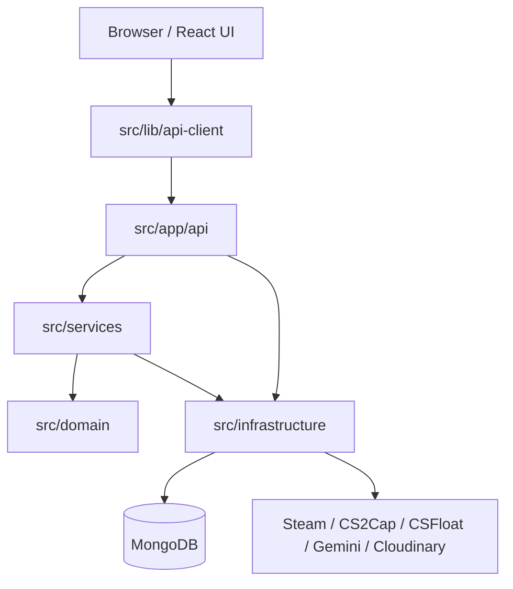
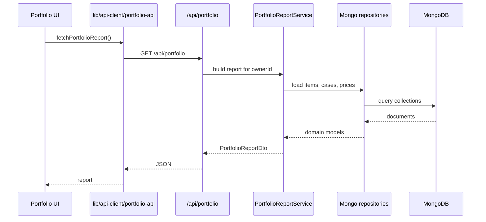
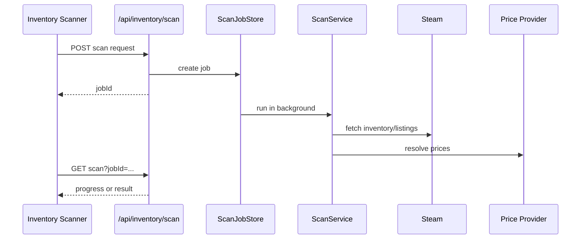
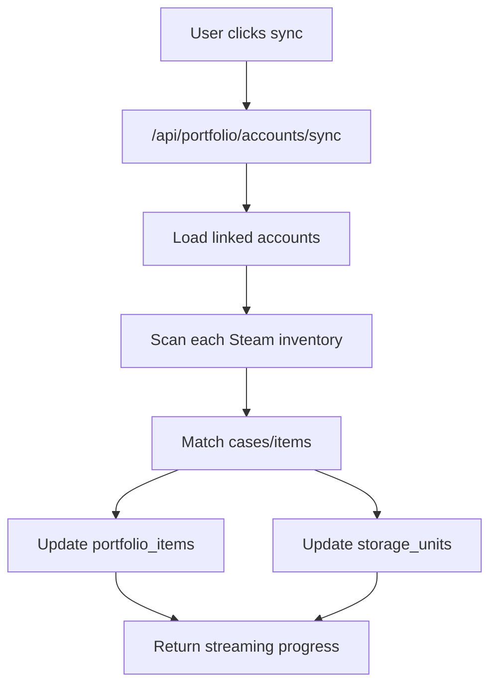
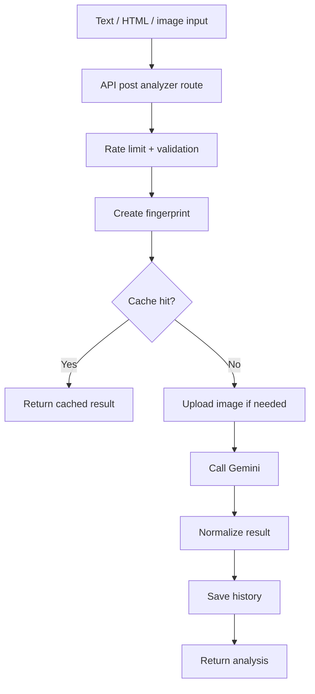

# Kiến Trúc Dự Án

Tài liệu này giải thích cách dự án CS2 Tracking được tổ chức, các layer chính, luồng dữ liệu và những quy ước cần giữ khi phát triển tiếp.

## Tổng Quan

Dự án là một ứng dụng Next.js App Router có frontend React và API routes chạy trong cùng repo. Kiến trúc hiện tại là **hybrid Clean Architecture**:

- `domain` giữ model và interface cốt lõi.
- `services` giữ business logic và orchestration server-side.
- `infrastructure` giữ MongoDB, repository implementation và external drivers.
- `app/api` là HTTP boundary.
- `components` là UI.
- `lib/api-client` là client-side wrapper để UI gọi API nội bộ.



Một số API route lớn vẫn còn thao tác MongoDB trực tiếp. Đó là nợ kỹ thuật cần trả dần, không phải mẫu lý tưởng nên copy cho code mới.

## Bản Đồ Thư Mục

| Thư mục | Vai trò | Ví dụ |
| --- | --- | --- |
| `src/app` | Next.js routes, pages, layouts | `app/api/portfolio/route.ts`, `app/portfolio/page.tsx` |
| `src/components` | UI theo feature | `portfolio`, `inventory-scanner`, `steam-accounts` |
| `src/lib/api-client` | Hàm `fetch` dùng trong browser | `portfolio-api.ts`, `steam-accounts-api.ts` |
| `src/services` | Application services/server logic | `portfolio-service.ts`, `scan-service.ts`, `auth-service.ts` |
| `src/domain` | Model, type, repository interface | `portfolio-item.ts`, `repositories.ts` |
| `src/infrastructure` | MongoDB, repository, external provider | `db`, `repositories`, `price`, `steam.ts` |
| `src/stores` | Store nhỏ cho UI progress/toast | `import-store.ts`, `sync-store.ts` |
| `src/types` | DTO/type dùng chung | `report.ts`, `portfolio-import.ts` |
| `src/utils` | Helper không gắn feature | `format.ts`, `validation.ts`, `local-api-key.ts` |
| `src/i18n` | Bản dịch | `vi.json`, `en.json` |
| `src/data` | Dữ liệu tĩnh | tier, multiplier, sticker map |

## Quy Tắc Dependency

### Hướng phụ thuộc nên giữ

```text
components -> lib/api-client -> app/api
app/api -> services -> domain
services -> infrastructure khi cần truy cập driver cụ thể
infrastructure -> domain
utils/types -> được dùng bởi nhiều layer
```

### Không nên làm

- `services` import từ `components`.
- `lib/api-client` import từ `components` hoặc `stores`.
- `domain` import framework, database, React, Next.js.
- API route mới chứa nhiều logic nghiệp vụ dài hàng trăm dòng.
- Type dùng chung nằm trong barrel UI rồi bị server/service import ngược.

### Khi cần thêm code mới

| Nếu bạn đang thêm | Nên đặt ở đâu |
| --- | --- |
| UI feature | `src/components/<feature>` |
| Hook riêng của feature | `src/components/<feature>/hooks` |
| Fetch wrapper client-side | `src/lib/api-client` |
| Route handler | `src/app/api/<feature>` |
| Business logic server-side | `src/services` |
| Entity hoặc repository interface | `src/domain` |
| Mongo repository/mapper/driver | `src/infrastructure` |
| DTO/type dùng chung | `src/types` |
| Helper thuần | `src/utils` |

## Layer Chi Tiết

### Presentation: `src/components`

UI được chia theo feature:

- `dashboard`: màn portfolio tổng, cards, import Excel, mutations.
- `portfolio`: bảng portfolio, dialog thêm/sửa, Storage Unit panel, item detail.
- `inventory-scanner`: UI quét inventory, filter, column, price retry.
- `steam-accounts`: liên kết account, cookie, wallet, sync, Storage Unit.
- `post-analyzer`: nhập bài đăng/HTML/ảnh và hiện kết quả AI.
- `auth`: session, Google login status, CS2Cap API key modal.
- `ui`: primitive UI dùng chung.

Nguyên tắc: component nên gọi `src/lib/api-client` hoặc hook feature, không nên gọi MongoDB/secret/server service trực tiếp.

### Client API: `src/lib/api-client`

Đây là nơi đóng gói các request từ browser tới API routes:

- `portfolio-api.ts`: CRUD portfolio, refresh price, import Excel streaming.
- `steam-accounts-api.ts`: Steam account, cookie check, Storage Unit list.
- `buff-api.ts`: refresh giá BUFF163 cho item.

Layer này nên thuần `fetch`, trả data/error rõ ràng. Nếu cần cập nhật store UI, dùng callback hoặc xử lý trong hook component.

### API Boundary: `src/app/api`

Route handler nên làm 4 việc:

1. Đọc session/owner/admin.
2. Validate input.
3. Gọi service/repository.
4. Trả `NextResponse`.

Một số route hiện vẫn có logic lớn, đặc biệt:

- `portfolio/import-inventory`
- `portfolio/accounts/sync`
- `portfolio/accounts/sync/single`
- `portfolio/[id]`

Khi refactor, ưu tiên đưa orchestration sang service riêng để route mỏng hơn.

### Services: `src/services`

Đây là nơi chứa logic nghiệp vụ:

- `portfolio-service.ts`: CRUD item có domain rule cơ bản.
- `portfolio-report-service.ts`: tạo report, tính summary và row.
- `portfolio-import-service.ts`: import row đã normalize.
- `portfolio-sync.ts`: logic sync inventory vào portfolio.
- `scan-service.ts`: scan Steam inventory, market listings, hold, pricing.
- `scan-cache.ts`, `scan-job-store.ts`: cache và job state.
- `auth-service.ts`: Google OAuth, session, admin check.
- `post-analysis-service.ts`: Gemini analysis và history.
- `crypto-service.ts`: mã hóa/giải mã dữ liệu nhạy cảm.

Service mới nên tránh import UI. Nếu cần type từ UI, hãy đưa type đó sang `src/types` hoặc `src/domain`.

### Domain: `src/domain`

Layer domain giữ các type/contract cốt lõi:

- `case-item.ts`
- `portfolio-item.ts`
- `portfolio-report.ts`
- `price.ts`
- `storage-unit.ts`
- `repositories.ts`
- `price-provider.ts`
- `pattern-info.ts`

Domain nên thuần TypeScript, không biết MongoDB, Next.js hay React.

### Infrastructure: `src/infrastructure`

Chứa chi tiết kỹ thuật:

- `db/mongo-client.ts`: kết nối MongoDB, bootstrap index lazy.
- `db/ensure-indexes.ts`: tạo index cần thiết.
- `db/mappers.ts`: map Mongo document <-> domain.
- `repositories/*`: repository MongoDB.
- `price/steam-market-price-provider.ts`: Steam Market, CSGOTrader fallback, tỷ giá USD/VND.
- `steam.ts`: Steam profile, cookie, wallet, eligibility.
- `cloudinary.ts`: upload ảnh.
- `rate-limiter.ts`: rate limit MongoDB-backed.
- `gemini-retry.ts`: retry/backoff cho Gemini.

## Luồng Dữ Liệu Chính

### 1. Portfolio dashboard



### 2. Inventory scan



### 3. Steam account sync



### 4. Post analyzer



## MongoDB Collections

| Collection | Vai trò | Ghi chú |
| --- | --- | --- |
| `users` | User Google OAuth | unique theo provider/providerAccountId |
| `portfolio_accounts` | Steam account liên kết | ownerId + steamId64 unique |
| `portfolio_items` | Item trong portfolio | ownerId là filter quan trọng |
| `cases` | Catalog case/item | search theo name/marketHashName |
| `price_snapshots` | Lịch sử giá | caseId + capturedAt |
| `storage_units` | Storage Unit của Steam | ownerId + steamId64 |
| `inventory_scan_cache` | Cache scan inventory | TTL theo `expiresAt` |
| `scan_jobs` | Job scan ngắn hạn | TTL 1 giờ |
| `post_analysis_history` | Kết quả/cached AI analysis | fingerprint unique |
| `rate_limits` | Rate limit theo key/IP | TTL theo `updatedAt` |
| `bug_reports` | Bug report của user | admin đọc/đổi status |

Index được tạo trong `src/infrastructure/db/ensure-indexes.ts`. Hàm này được gọi lazy trong `getDatabase()`.

## Owner, Auth Và Admin

- User đăng nhập qua Google OAuth.
- User chưa đăng nhập có guest owner/session riêng.
- Data user-facing cần filter bằng `ownerId`.
- Helper owner filter nằm ở `src/infrastructure/db/owner-filter.ts`.
- Admin được xác định qua `ADMIN_EMAILS`.
- Trong production, admin route/API không nên fail-open nếu chưa cấu hình admin.

## Bảo Mật Dữ Liệu

- Steam cookie và CS2Cap key cần được mã hóa trước khi lưu.
- Secret chỉ được đọc server-side từ env.
- Image proxy cần giới hạn domain hợp lệ để tránh SSRF.
- Rate limit áp dụng cho API tốn tài nguyên cao: Gemini, CS2Cap validate, price retry, bug report.
- File upload cần validate mime type, kích thước và số lượng.
- Khi thao tác Storage Unit/portfolio, luôn kèm owner filter.

## External Integrations

| Service | Dùng cho | Vị trí chính |
| --- | --- | --- |
| Steam Community | profile, inventory, market listings, wallet | `src/infrastructure/steam.ts`, `src/services/scan-service.ts` |
| Steam Market | giá Steam | `src/infrastructure/price/steam-market-price-provider.ts` |
| CSGOTrader | fallback giá khi Steam rate limit | `src/infrastructure/price/steam-market-price-provider.ts` |
| CS2Cap | giá BUFF163 và validate key | `src/utils/api-client.ts`, `src/services/parser/buff-price-client.ts` |
| CSFloat | inspect float/paint seed | `src/services/pattern/csfloat-client.ts` |
| Gemini | phân tích text/HTML/ảnh | `src/services/parser/gemini-client.ts` |
| Cloudinary | upload ảnh cho analyzer/bug report | `src/infrastructure/cloudinary.ts` |

## Refactor Roadmap

Những điểm nên ưu tiên khi có thời gian:

1. Tách route import/sync lớn thành service nhỏ hơn.
2. Chia component rất lớn thành subcomponent/hook theo domain UI.
3. Giảm việc `services` phụ thuộc trực tiếp `infrastructure` nếu muốn đi theo Clean Architecture chặt hơn.
4. Chuẩn hóa DTO cho request/response API.
5. Bổ sung test cho service quan trọng trước khi refactor sync/import sâu hơn.
