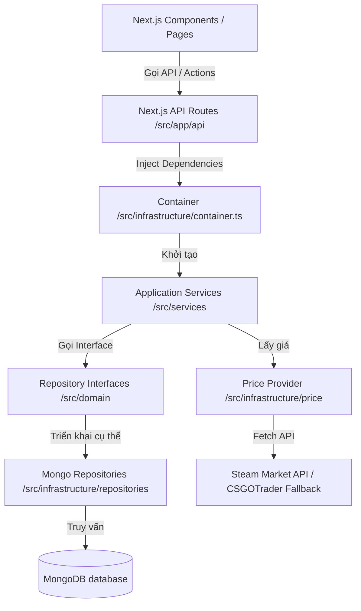
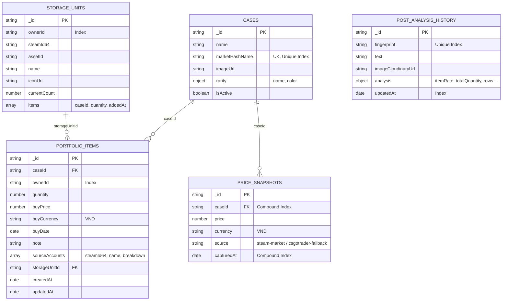

# Kiến Trúc Hệ Thống & Cấu Trúc Cơ Sở Dữ Liệu 🏛️

Tài liệu này mô tả chi tiết kiến trúc phần mềm, luồng dữ liệu, cấu trúc cơ sở dữ liệu (MongoDB) và các tích hợp API bên ngoài của dự án **CS2 Case Tracker**.

---

## 1. Kiến Trúc Tổng Quan (System Architecture)

Dự án được thiết kế theo mô hình **Clean Architecture lai Domain-Driven Design (DDD)** nhằm cô lập logic nghiệp vụ cốt lõi khỏi các chi tiết công nghệ (Database, Web Framework, Third-party APIs).



### Các lớp Kiến trúc
1. **Domain Layer (`src/domain`)**:
   - Chứa các thực thể cốt lõi (`CaseItem`, `PortfolioItem`, `StorageUnit`, `PriceSnapshot`).
   - Định nghĩa các interface cho repositories (`CaseRepository`, `PortfolioRepository`...).
   - Lớp này hoàn toàn thuần khiết (Pure TypeScript), không phụ thuộc vào bất kỳ framework hay thư viện database nào.
2. **Services Layer (`src/services`)**:
   - Nơi xử lý các nghiệp vụ (Business Logic) chính của ứng dụng.
   - Ví dụ: `PortfolioReportService` chịu trách nhiệm tính toán tổng giá trị đầu tư, tỷ lệ sinh lời, phân bổ danh mục; `PostAnalysisService` quản lý phân tích bài viết bằng AI.
3. **Infrastructure Layer (`src/infrastructure`)**:
   - Triển khai cụ thể các interface của Domain Layer (các class Repositories truy vấn MongoDB).
   - Tích hợp với bên ngoài: Lấy giá từ Steam Market API, fallback từ file cache hoặc CSGOTrader API.
4. **Presentation/API Layer (`src/app` & `src/components`)**:
   - Định nghĩa giao diện người dùng (React components) và các API endpoints của Next.js phục vụ cho Client.

---

## 2. Cấu Trúc Cơ Sở Dữ Liệu (MongoDB Schemas)

Mặc dù MongoDB là cơ sở dữ liệu phi quan hệ (NoSQL), dự án vẫn định nghĩa các cấu trúc tài liệu (Documents) rõ ràng thông qua TypeScript Types và Mappers (`src/infrastructure/db/mappers.ts`).

### Sơ đồ Thực thể (Entity Relationship Diagram - ERD)



---

### Chi tiết Các Collections

#### 1. Collection: `cases`
Lưu trữ danh mục các loại hòm CS2 được hỗ trợ theo dõi trong hệ thống.
- **Cấu trúc Document:**
  ```typescript
  {
    _id: ObjectId;
    name: string;             // Tên hiển thị (ví dụ: "Recoil Case")
    marketHashName: string;   // Tên định danh trên Steam Market (ví dụ: "Recoil Case")
    imageUrl?: string;        // Link ảnh hòm từ Steam CDN
    rarity?: {                // Độ hiếm của hòm
      name: string;           // Tên độ hiếm (ví dụ: "Base Grade")
      color: string;          // Mã màu hex (ví dụ: "#b0c3d9")
    };
    isActive: boolean;        // Trạng thái kích hoạt
    createdAt?: Date;
    updatedAt?: Date;
  }
  ```
- **Indexes:**
  - `{ marketHashName: 1 }` (Unique): Đảm bảo không trùng lặp hòm.
  - `{ name: "text", marketHashName: "text" }` (Text Index): Phục vụ tìm kiếm nhanh (Search).

#### 2. Collection: `portfolio_items`
Lưu trữ danh sách hòm mà người dùng đang theo dõi trong danh mục đầu tư của họ.
- **Cấu trúc Document:**
  ```typescript
  {
    _id: ObjectId;
    caseId: string;           // Liên kết tới _id của collection 'cases'
    ownerId: string;          // ID người sở hữu danh mục (mặc định: "guest" nếu chưa đăng nhập)
    quantity: number;         // Số lượng hòm sở hữu
    buyPrice: number;         // Giá mua vào
    buyCurrency: string;      // Tiền tệ khi mua (Mặc định: "VND")
    buyDate: Date;            // Ngày mua
    note?: string;            // Ghi chú thêm
    sourceAccounts: Array<{   // Breakdown số lượng hòm từ các tài khoản Steam
      steamId64: string;
      name: string;
      breakdown?: {
        tradeable: number;    // Số lượng có thể giao dịch ngay
        onMarket: number;     // Số lượng đang treo bán trên chợ
        tradeProtected: number;
        hold: number;         // Số lượng đang bị hold
        holdDetails?: Array<{
          quantity: number;
          holdDays: number;
        }>;
      };
    }>;
    tradeHoldUntil?: Date;    // Ngày hết hạn hold giao dịch (nếu có)
    isTemporaryPrice?: boolean;
    storageUnitId?: string;   // Liên kết tới _id của 'storage_units' (nếu hòm nằm trong Storage Unit)
    createdAt: Date;
    updatedAt: Date;
  }
  ```
- **Indexes:**
  - Mặc định tìm kiếm và sắp xếp theo `{ ownerId: 1 }` và `{ createdAt: -1 }`.

#### 3. Collection: `price_snapshots`
Lưu lịch sử biến động giá của từng hòm để vẽ biểu đồ và phân tích giá.
- **Cấu trúc Document:**
  ```typescript
  {
    _id: ObjectId;
    caseId: string;           // Liên kết tới _id của 'cases'
    price: number;            // Mức giá ghi nhận được (VND)
    currency: string;         // Tiền tệ ("VND")
    source: string;           // Nguồn lấy giá (ví dụ: "steam-market", "csgotrader-fallback")
    capturedAt: Date;         // Thời gian ghi nhận giá
  }
  ```
- **Indexes:**
  - Compound Index: `{ caseId: 1, capturedAt: -1 }` giúp tối ưu việc lấy giá mới nhất hoặc giá gần nhất trước một thời điểm cụ thể của hòm.

#### 4. Collection: `storage_units`
Lưu trữ thông tin chi tiết các hòm lưu trữ (Storage Units) chứa đồ của người dùng từ Steam.
- **Cấu trúc Document:**
  ```typescript
  {
    _id: ObjectId;
    ownerId: string;          // Mặc định: "guest"
    steamId64: string;        // SteamID của tài khoản sở hữu
    assetId: string;          // ID vật phẩm Storage Unit trên Steam
    name: string;             // Tên hòm lưu trữ (do người dùng đặt)
    iconUrl: string | null;
    currentCount: number;     // Tổng số lượng item trong hòm (tối đa 1000)
    items: Array<{            // Danh sách các hòm CS2 bên trong Storage Unit
      caseId: string;
      marketHashName: string;
      quantity: number;
      addedAt: Date;
    }>;
    createdAt: Date;
    updatedAt: Date;
  }
  ```

#### 5. Collection: `post_analysis_history`
Lưu trữ lịch sử phân tích các bài đăng rao vặt mua bán hoặc hình ảnh chụp kho đồ của người dùng.
- **Cấu trúc Document:**
  ```typescript
  {
    _id: ObjectId;
    fingerprint: string;      // Mã MD5 hash/fingerprint của nội dung text/ảnh để tránh phân tích trùng lặp
    text: string;             // Nội dung text phân tích
    imageFileName?: string;
    imageCloudinaryUrl?: string; // Link ảnh upload lên Cloudinary
    analysis: {               // Kết quả phân tích trích xuất từ Gemini AI
      itemSource: "text" | "image";
      cacheStatus?: "hit" | "miss";
      itemRate: number;
      allRate: number;
      totalQuantity: number;
      totalSteamValue: number;
      totalItemRateValue: number;
      totalAllRateValue: number;
      rows: Array<{
        inputName: string;
        marketHashName: string;
        name: string;
        imageUrl?: string;
        quantity: number;
        steamUnitPrice: number | null;
        itemRateUnitPrice: number | null;
        allRateTotalPrice: number | null;
      }>;
      unknownItems: Array<{ inputName: string; quantity: number }>;
    };
    createdAt: Date;
    updatedAt: Date;
  }
  ```
- **Indexes:**
  - `{ fingerprint: 1 }` (Unique): Ngăn ngừa việc trùng lặp lượt phân tích.
  - `{ updatedAt: -1 }`: Hỗ trợ sắp xếp nhật ký gần đây.

---

## 3. Tích Hợp API Bên Ngoài (External API Integrations)

```mermaid
sequenceDiagram
    participant App as CS2 Case Tracker
    participant Steam as Steam Market API
    participant CSGO as CSGOTrader Prices API
    participant Gemini as Google Gemini AI API
    
    rect rgb(20, 20, 30)
        note right of App: Luồng cập nhật giá hòm
        App->>Steam: Request Price (AppID: 730, Currency: 15)
        alt Steam trả về 200 OK
            Steam-->>App: Trả về giá VND
        else Steam bị Rate Limit (429) hoặc Lỗi (500)
            App->>CSGO: Request latest prices (USD)
            CSGO-->>App: Trả về JSON giá hòm (USD)
            App->>App: Lấy tỷ giá USD/VND hiện tại & quy đổi thành VND
        end
    end

    rect rgb(30, 20, 20)
        note right of App: Luồng phân tích bằng AI
        App->>Gemini: Gửi text bài đăng hoặc ảnh kho đồ
        Gemini-->>App: Trả về JSON danh sách hòm & số lượng trích xuất được
    end
```



### 1. Steam Community Market API
- **Endpoint:** `https://steamcommunity.com/market/priceoverview/`
- **Chức năng:** Lấy giá hiện tại (lowest_price / median_price) của hòm theo `market_hash_name`.
- **Hạn chế:** Steam chặn rate limit rất gắt (lỗi 429).
- **Giải pháp:** Hệ thống sử dụng cơ chế retry thông minh và tự động chuyển sang sử dụng API của CSGOTrader làm fallback khi gặp lỗi 429.

### 2. CSGOTrader Price API
- **Endpoint:** `https://prices.csgotrader.app/latest/steam.json`
- **Chức năng:** Tải file JSON chứa giá toàn bộ vật phẩm Steam (theo USD).
- **Cơ chế cache:** Hệ thống tải file này và lưu cache thành file `steam_prices_fallback_cache.json` local (hết hạn sau 6 giờ) để tránh spam API bên ngoài. Khi quy đổi sang VND, hệ thống sẽ gọi API tỷ giá từ Exchange Rate API (`https://open.er-api.com/v6/latest/USD`) để cập nhật tỷ giá tự động theo thời gian thực.

### 3. Google Gemini AI API
- **Model:** `gemini-2.5-flash`
- **Chức năng:** Nhận diện ký tự và ngôn ngữ tự nhiên từ ảnh chụp kho đồ hoặc văn bản bài đăng, sau đó phân tích thành cấu trúc dữ liệu JSON gồm: tên hòm, số lượng, tỷ giá bán mong muốn.

### 4. Cloudinary API
- **Chức năng:** Lưu trữ tạm thời các file ảnh kho đồ người dùng tải lên để Gemini AI xử lý, đảm bảo tốc độ và bảo mật đường truyền.
