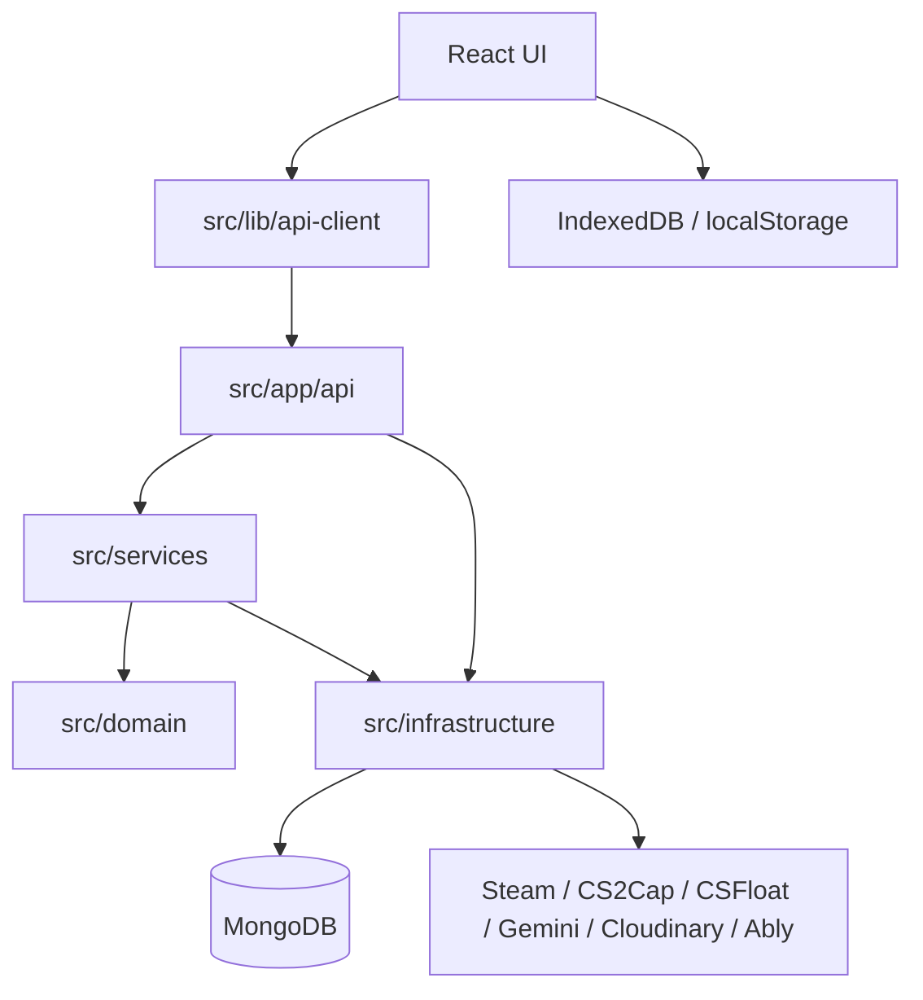
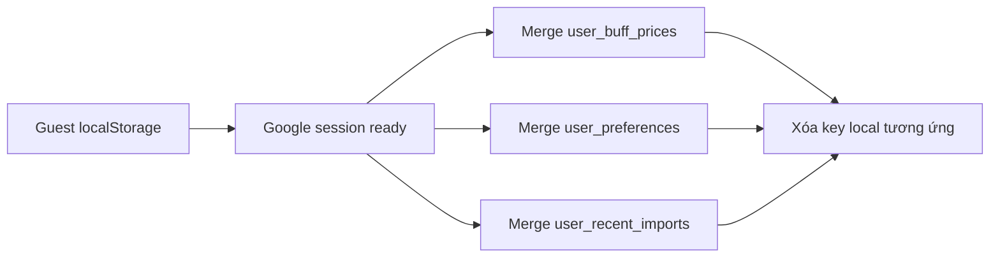
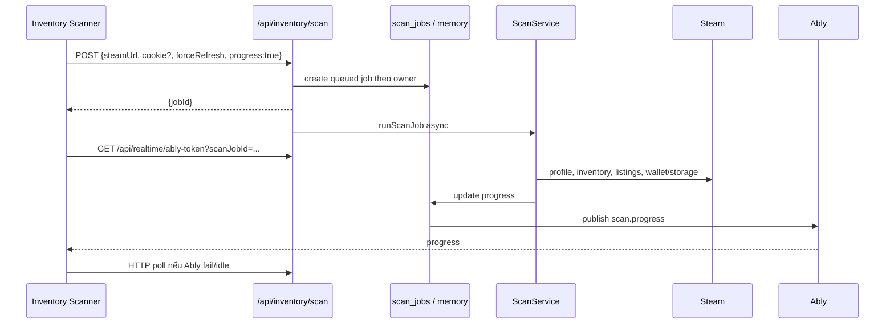

# Kiến Trúc Dự Án

Tài liệu này mô tả kiến trúc đang có trong code: cách request đi qua các layer, cách xác định owner, dữ liệu nằm ở MongoDB/IndexedDB/`localStorage`, các cache và cơ chế realtime/fallback.

## Tổng Quan

CS2 Tracking là ứng dụng Next.js App Router; React UI và API routes nằm chung repo. Kiến trúc là hybrid Clean Architecture: phần domain/service đã được tách, nhưng một số route lớn vẫn thao tác MongoDB trực tiếp.



## Bản Đồ Thư Mục

| Thư mục              | Vai trò                                          | Ví dụ                                                  |
| -------------------- | ------------------------------------------------ | ------------------------------------------------------ |
| `src/app`            | Pages, layouts, metadata, API routes             | `app/api/portfolio/route.ts`                           |
| `src/components`     | UI và hook theo feature                          | `dashboard`, `portfolio`, `inventory-scanner`          |
| `src/lib/api-client` | Browser fetch wrappers và realtime subscribers   | `portfolio-api.ts`, `user-preferences-api.ts`          |
| `src/lib`            | Tiện ích hạ tầng phía browser                    | `async-json-storage.ts`                                |
| `src/services`       | Business logic, cache, sync, realtime publishers | `portfolio-sync.ts`, `scan-service.ts`                 |
| `src/domain`         | Entity/type/contract cốt lõi                     | `portfolio-item.ts`, `storage-unit.ts`                 |
| `src/infrastructure` | MongoDB, repository, Steam/image/price providers | `db`, `cases`, `price`                                 |
| `src/hooks`          | Hook dùng chung                                  | `use-portfolio-realtime.ts`                            |
| `src/stores`         | Store nhỏ cho toast/progress                     | `import-store.ts`, `sync-store.ts`                     |
| `src/types`          | DTO/type dùng chung                              | `report.ts`, `recent-import.ts`, `user-preferences.ts` |
| `src/utils`          | Helper thuần và browser helpers                  | format, validation, cookie, URL                        |

Hướng phụ thuộc mong muốn:

```text
components -> lib/api-client -> app/api
app/api -> services -> domain
services -> infrastructure khi cần implementation cụ thể
domain -> không phụ thuộc UI/API/infrastructure
```

Một số route portfolio, import và sync hiện chứa cả orchestration lẫn thao tác MongoDB. Khi mở rộng, ưu tiên đưa logic có thể test sang `src/services` hoặc repository.

## Owner, Auth Và Quyền Truy Cập

### Owner ID

`src/services/auth-service.ts` cung cấp hai đường xác định auth:

- `getPortfolioOwnerId()` luôn trả owner: `google:<userId>` nếu có session, nếu không là `guest:<uuid>`.
- `checkAuth()` trả `{ authorized, ownerId }`. Nếu Google OAuth đã cấu hình, guest có `authorized: false`; nếu OAuth chưa cấu hình, guest được coi là authorized trong môi trường không yêu cầu login.

Guest ID nằm trong cookie `cs2t_guest_id`:

- HTTP-only;
- `sameSite=lax`;
- `secure` ở production;
- thời hạn 1 năm.

### Merge guest khi login

Sau Google callback, code chuyển dữ liệu từ guest owner sang `google:<userId>`:

1. `portfolio_items`: cập nhật `ownerId`.
2. `storage_units`: cập nhật `ownerId`.
3. `portfolio_accounts`: chuyển từng account; nếu owner mới đã có cùng `steamId64`, bản guest bị xóa.
4. Xóa cookie guest sau khi merge.

Các dữ liệu user-only như BUFF prices, preferences và recent imports được migrate phía client từ `localStorage` sau khi session login sẵn sàng, không nằm trong transaction merge guest phía server.

### Nhóm quyền hiện tại

| Nhóm                                                       | Quyền hiện tại                                                                             |
| ---------------------------------------------------------- | ------------------------------------------------------------------------------------------ |
| Portfolio, account, Storage Unit, scan                     | Hỗ trợ owner guest hoặc Google; mọi query phải scope theo owner                            |
| Import scan vào portfolio                                  | Yêu cầu Google session                                                                     |
| BUFF prices, preferences, recent imports, CS2Cap user keys | Yêu cầu Google session                                                                     |
| Ably token và hai SSE user routes                          | Yêu cầu Google session                                                                     |
| Bug report `POST`                                          | Cho phép guest/user, có rate limit                                                         |
| Bug report admin `GET/PATCH`                               | Email trong `ADMIN_EMAILS`                                                                 |
| Post Analyzer mutations và xóa history                     | `isAdminAccessAllowed`; production thực tế cần Google OAuth + admin email                  |
| Đọc post-analysis history                                  | `checkAuth().authorized`; dữ liệu history hiện là collection dùng chung, không scope owner |

## Nguồn Dữ Liệu

### MongoDB

MongoDB là nguồn chính cho dữ liệu portfolio và dữ liệu cần dùng giữa nhiều máy:

- Portfolio items, linked Steam accounts, Storage Units.
- Catalog/ảnh case, price snapshots, scan cache/jobs, inspect cache.
- User BUFF prices, preferences, recent imports và CS2Cap keys.
- Post-analysis history, bug reports, rate limits và event logs.

### IndexedDB

`src/lib/async-json-storage.ts` tạo database `cs2t_async_json_storage`, version 1, object store `entries`. Scanner lưu:

- `inventory-scanner:accounts`;
- `inventory-scanner:manual-items`.

`scanner-persistence.ts` ưu tiên IndexedDB. Nếu IndexedDB không dùng được, code fallback `localStorage`. Hai key legacy `cs2t_accounts` và `cs2t_manualItems` được tự migrate sang IndexedDB rồi xóa khỏi localStorage.

### localStorage

localStorage vẫn dùng cho dữ liệu browser-local hoặc guest:

| Key                                          | Nội dung                            |
| -------------------------------------------- | ----------------------------------- |
| `cs2t_buffPricesCny`                         | BUFF price thủ công của guest       |
| `cs2t_rateSi`, `cs2t_rateAll`, `cs2t_rateLe` | Pricing rate local/legacy           |
| `cs2t_buffCnyToVndRate`                      | Tỷ giá CNY/VND của guest            |
| `cs2t_excelMappingTemplates`                 | Excel mapping templates của guest   |
| `cs2t_recentImports`                         | 10 lần import gần nhất của guest    |
| `cs2t_scanner_columnVisibility`              | Column visibility scanner           |
| `cs2t_currency`, `cs2t_theme`, `cs2t_lang`   | UI preferences local                |
| `cs2cap_local_api_key`                       | Key local legacy/helper phía client |

Ngoài ra, lựa chọn owner/account/Storage Unit/trạng thái khi sửa item thủ công được lưu bởi `manual-ownership-preferences.ts` để làm mặc định lần sau trên cùng browser.

### Migrate dữ liệu browser khi login



- BUFF prices: merge map local lên server.
- Excel mapping templates: merge theo `id`, sort mới nhất, giới hạn 50.
- Pricing preference: chỉ đẩy giá local nếu server chưa có key tương ứng.
- Recent imports: merge theo `id`, sort theo thời gian, giới hạn 10.

## Portfolio Và Pricing

### Portfolio report cache

`src/services/portfolio-report-cache.ts` giữ `PortfolioReportDto` trong memory theo owner trong 60 giây.

- `GET /api/portfolio` dùng cache nếu chưa hết hạn và không có `portfolio_realtime_events` mới hơn `cachedAt`.
- `GET /api/portfolio?fresh=1` luôn build report mới.
- Mutation tạo/sửa/xóa thường build report và cập nhật cache; các import/sync dài invalidate cache trước khi publish event.
- Client realtime dùng `fetchFreshPortfolioReport()` để tránh đọc lại bản cache cũ.

Cache là per-process, không phải distributed cache. Event log + `fresh=1` là lớp bảo vệ khi deploy nhiều instance.

### Hai nhánh công thức giá

UI quyết định nhánh dựa trên việc item có giá BUFF hợp lệ:

- **Có BUFF**: nhập giá CNY và tỷ giá; đơn giá VND được tính từ công thức. UI sửa lot có thể hiển thị cả công thức mua và bán.
- **Không có BUFF**: giá market VND ở mức 100% chỉ đọc; user nhập trực tiếp đơn giá mua/bán VND.
- `buyPrice` trong domain là **đơn giá**, không phải tổng lô.
- Tổng lô = `quantity × unitPrice`, làm tròn về số nguyên VND.

Portfolio item còn có thể lưu các trường accessory/pattern:

- `inspectLink`, `dopplerPhase`, `patternInfo`;
- `stickerPriceRate`, `stickerPriceAdd`;
- `stickerBuyPriceRate`, `stickerBuyPriceAdd`;
- `stickerScanTotalPrice`, `stickerScanPriceCapturedAt`.

Khi `stickerBuyPriceRate` hoặc tổng giá phụ kiện thay đổi, API tính lại `stickerBuyPriceAdd`.

### Excel import/export

`src/components/portfolio/portfolio-excel.ts`:

- import `.xlsx`, `.csv`, `.tsv`;
- từ chối `.xls` legacy;
- giới hạn file text ở 2 MiB;
- tự dò header tiếng Anh/Việt đã normalize;
- hỗ trợ mapping template cho name, quantity, buy price, date, note, case ID;
- bỏ qua các dòng tổng/formula như `Total`, `Tổng`, `Average`;
- export `.xlsx` với sheet `Portfolio`, header in đậm, sticky row và column widths.

## Realtime

### Cấp token

`GET /api/realtime/ably-token` chỉ dành cho user đã login. Token:

- TTL 1 giờ;
- client ID là Google user ID;
- chỉ có capability `subscribe` cho một channel được chọn;
- mặc định cấp channel portfolio;
- kiểm tra owner scan job trước khi cấp channel scan;
- kiểm tra admin trước khi cấp channel bug report hoặc post-analysis history.

Client Ably ép transport `web_socket`, chờ tối đa khoảng 5 giây để kết nối và đóng client nếu connection `failed`/`suspended`.

### Channel và fallback

| Dữ liệu               | Channel / event                                                 | Fallback                                                                 |
| --------------------- | --------------------------------------------------------------- | ------------------------------------------------------------------------ |
| Portfolio             | `portfolio:<ownerId>` / `portfolio.changed`                     | SSE `/api/realtime/portfolio` + event log; Ably và SSE được mở đồng thời |
| Scan progress         | `scan:<ownerId>:<jobId>` / `scan.progress`                      | HTTP poll route scan mỗi 900 ms                                          |
| Recent imports        | `user:<ownerId>:recent-imports` / `user-recent-imports.changed` | SSE `/api/realtime/user-recent-imports` + event log                      |
| User BUFF prices      | `user:<ownerId>:buff-prices` / `user-buff-prices.changed`       | API response/refetch trực tiếp                                           |
| User preferences      | `user:<ownerId>:preferences` / `user-preferences.changed`       | API response/refetch trực tiếp                                           |
| CS2Cap settings       | `user:<ownerId>:settings` / `user-settings.changed`             | Refetch khi mở modal/sau mutation                                        |
| Bug reports           | `admin:bug-reports` / `bug-report.changed`                      | Poll 5 giây                                                              |
| Post-analysis history | `admin:post-analysis-history` / `post-analysis-history.changed` | Invalidate/refetch sau mutation local                                    |

Các subscriber client debounce callback khoảng 250 ms để gộp nhiều event gần nhau.

### Portfolio SSE

Server publish `PortfolioRealtimeEvent` theo ba đường:

1. In-memory subscribers cùng process.
2. Collection `portfolio_realtime_events` để catch-up/cache guard.
3. Ably nếu có key.

SSE gửi heartbeat, poll event log và loại event trùng theo ID. Event action hiện có:

```ts
type PortfolioRealtimeAction =
  | 'created'
  | 'updated'
  | 'deleted'
  | 'deleted_many'
  | 'imported'
  | 'synced'
  | 'prices_refreshed';
```

### Recent imports SSE

Recent import event cũng được emit in-memory, lưu trong `user_recent_import_realtime_events`, publish Ably và đọc lại qua SSE. SSE heartbeat mỗi 25 giây, poll event log mỗi 1,5 giây và giới hạn mỗi lần đọc 100 event.

## Luồng Inventory Scan



Mỗi `GET /api/inventory/scan?jobId=...` kiểm tra owner. Job được giữ trong memory và MongoDB; nếu memory miss, route khôi phục từ collection `scan_jobs`.

### Scan cache

- Kết quả mới hết hạn ở 14:00 giờ Việt Nam kế tiếp.
- Public cache key: `public:<steamId64>`.
- Private cache key: `private:<ownerId>:<steamId64>`.
- Public response bị loại `walletBalance`, `walletBalanceVnd` và `storageUnits`.
- TTL index xóa document sau 24 giờ tính từ `expiresAt`, tạo khoảng stale fallback.
- Khi live scan fail, service thử nhiều scope cache theo request: private có cookie trước, rồi public; cache có thể được đọc với `ignoreExpiry`.
- Steam fetch có retry cho lỗi tạm thời/rate limit và UI dịch riêng các lỗi HTTP/timeout.

## Storage Unit Và Sync

- Mỗi Storage Unit có capacity tối đa `1000` item (`STORAGE_UNIT_MAX_CAPACITY`).
- Khi tạo/sửa/xóa portfolio lot có `storageUnitId`, route đồng thời điều chỉnh mảng item trong `storage_units`.
- Bulk delete xử lý cả item portfolio thường và item ảo chỉ tồn tại trong Storage Unit.
- Sync account đối chiếu inventory hiện tại với portfolio, cập nhật source-account breakdown, trade hold, Storage Units và account status.
- Sync toàn bộ và sync single trả progress bằng SSE, sau đó publish portfolio action `synced`.

## MongoDB Collections Và Index

### Index bootstrap trung tâm

`ensureIndexes()` chạy lazy khi `getDatabase()` thành công lần đầu:

| Collection                  | Index                                                                                  |
| --------------------------- | -------------------------------------------------------------------------------------- |
| `portfolio_items`           | `ownerId`; `ownerId + createdAt`                                                       |
| `portfolio_accounts`        | `ownerId + steamId64` unique                                                           |
| `storage_units`             | `ownerId`; `ownerId + steamId64`                                                       |
| `users`                     | `id` unique; `provider + providerAccountId` unique                                     |
| `user_buff_prices`          | `ownerId + marketHashName` unique; `ownerId`                                           |
| `portfolio_realtime_events` | `ownerId + createdAt`; TTL 1 giờ trên `createdAt`                                      |
| `bug_reports`               | `createdAt`; `status`                                                                  |
| `inventory_scan_cache`      | TTL 24 giờ sau `expiresAt`; `steamId64`; `cacheKey`; `ownerId + steamId64 + hasCookie` |
| `scan_jobs`                 | `id` unique; TTL 1 giờ trên `createdAt`                                                |
| `rate_limits`               | `key` unique; TTL 1 giờ trên `updatedAt`                                               |

`getDatabase()` cũng cố xóa unique index legacy `importSource_1_caseId_1` để portfolio cho phép nhiều lot cùng item.

### Index do repository/service tự tạo

- `cases`: `marketHashName` unique và text index trên `name + marketHashName`.
- `post_analysis_history`: `fingerprint` unique, `updatedAt` giảm dần.
- `price_snapshots`: repository tự đảm bảo index snapshot.
- `inventory_scan_cache`: service tự kiểm tra/thay TTL index nếu cấu hình cũ khác 24 giờ.

Các collection `user_preferences`, `user_recent_imports`, `user_recent_import_realtime_events` và `pattern_inspect_cache` hiện chưa có entry trong bootstrap index trung tâm. Đây là trạng thái code hiện tại cần lưu ý khi dữ liệu tăng lớn.

## Ảnh Case Và Metadata

Khi repository đọc case còn thiếu ảnh:

1. Claim document bằng `imageLookupRetryAt` để tránh nhiều worker fetch cùng lúc.
2. Fetch Steam Market listing và lấy economy image.
3. Lưu `imageUrl`, `imageFetchedAt`, `updatedAt` vào `cases`.
4. Lỗi tạm thời retry sau 2 phút; not-found retry sau 6 giờ.
5. Xử lý tối đa 4 lookup song song mỗi batch.

## External Integrations

| Service           | Dùng cho                                          | File chính                                     | Env                                                       |
| ----------------- | ------------------------------------------------- | ---------------------------------------------- | --------------------------------------------------------- |
| Google OAuth      | Session và admin identity                         | `services/auth-service.ts`                     | `GOOGLE_CLIENT_ID`, `GOOGLE_CLIENT_SECRET`, `AUTH_SECRET` |
| Ably              | Realtime nhiều domain                             | `services/realtime/*`                          | `ABLY_API_KEY`                                            |
| Steam Community   | Profile, inventory, listing, wallet, Storage Unit | `infrastructure/steam.ts`, `services/scan-*`   | Cookie user                                               |
| Steam Market      | Giá và ảnh                                        | `infrastructure/price`, `infrastructure/cases` | Không bắt buộc                                            |
| CSGOTrader        | Fallback giá Steam                                | `steam-market-price-provider.ts`               | Không bắt buộc                                            |
| CS2Cap            | BUFF price, account/key validation                | `parser/buff-price-client.ts`                  | User key hoặc `CS2CAP_API_KEY`                            |
| CSFloat           | Float/paint seed                                  | `pattern/csfloat-client.ts`                    | `CSFLOAT_API_KEY` tùy chọn                                |
| Gemini            | Post Analyzer                                     | `parser/gemini-client.ts`                      | `GEMINI_API_KEY`, `GEMINI_MODEL`                          |
| Cloudinary        | Ảnh analyzer/bug report                           | `infrastructure/cloudinary.ts`                 | `CLOUDINARY_*`                                            |
| Exchange rate API | USD/VND fallback                                  | price provider                                 | Không bắt buộc                                            |

## Bảo Mật

- `AUTH_SECRET` ký session; production yêu cầu ít nhất 32 ký tự.
- Steam cookie và CS2Cap key dùng AES-256-GCM. `DATA_ENCRYPTION_KEY` được ưu tiên; nếu thiếu thì fallback `AUTH_SECRET`.
- `src/proxy.ts` áp dụng CSRF check cho mọi `POST/PUT/PATCH/DELETE` dưới `/api`: request phải có `Origin` hoặc `Referer` cùng host.
- API user data phải xác định owner sớm và dùng owner filter cho mọi query/update/delete.
- Ably secret chỉ ở server; client nhận token capability hẹp.
- `next.config.ts` đặt CSP, HSTS, `X-Frame-Options`, `nosniff` và referrer policy.
- Image proxy giới hạn host để giảm SSRF.
- Rate limit được lưu MongoDB để dùng giữa nhiều instance; production fail-closed nếu DB rate limiter lỗi.

## Quy Ước Khi Mở Rộng

| Nếu thêm                                | Vị trí ưu tiên                   |
| --------------------------------------- | -------------------------------- |
| UI feature                              | `src/components/<feature>`       |
| Hook riêng feature                      | `src/components/<feature>/hooks` |
| Hook dùng chung                         | `src/hooks`                      |
| Browser API wrapper/realtime subscriber | `src/lib/api-client`             |
| API route                               | `src/app/api/<feature>`          |
| Business logic/cache/realtime publisher | `src/services`                   |
| Entity/repository interface             | `src/domain`                     |
| Mongo/external implementation           | `src/infrastructure`             |
| DTO/type dùng chung                     | `src/types`                      |
| Helper thuần                            | `src/utils`                      |

Khi thêm collection/index/env/route/channel mới, cập nhật đồng thời tài liệu kiến trúc, API reference và deployment guide.
